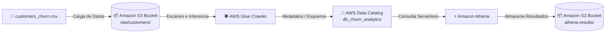

# AWS Cloud Data Lake & Customer Churn Analytics ☁️📊

## 📌 Descripción del Proyecto
Implementación de un **Data Lake serverless en AWS** para el análisis de retención y comportamiento de clientes (*Churn Rate*). El proyecto abarca desde el almacenamiento masivo de datos sin estructurar hasta la ejecución de consultas analíticas avanzadas en SQL para orientar decisiones de negocio.

---

## 🏗️ Arquitectura de Solución
1. **Amazon S3:** Almacenamiento desacoplado (*Data Lake Raw Layer*) de datos transaccionales en formato CSV.
2. **AWS Glue (Data Catalog & Crawler):** Inferencia automática del esquema e indexación de metadatos en la base de datos `db_churn_analytics`.
3. **Amazon Athena:** Motor de consultas SQL *serverless* ejecutado directamente sobre S3.

---

## 📈 Hallazgos Clave de Negocio (SQL Insights)

* **Tasa General de Churn:** **68.13%** sobre un total de 1,500 clientes analizados.
* **Riesgo por Antigüedad:** Los clientes de **0 a 1 año** presentan la mayor tasa de abandono (**80.38%**), reduciéndose al **61.86%** pasados los 3 años.
* **Impacto del Soporte Técnico:** Los clientes **Sin Contrato** que registran **$\ge$5 tickets de soporte** alcanzan un nivel crítico de fuga del **95.67%**.
* **Factor de Retención:** La combinación de **Contrato Anual** con **<5 tickets de soporte** disminuye el abandono al mínimo histórico del **24.44%**.

---

## 🚀 Cómo Replicar el Proyecto

1. **Cargar Datos:** Subir `customers_churn.csv` a la ruta `s3://<tu-bucket>/raw/customers/`.
2. **Catalogar Esquema:** Crear y ejecutar el Glue Crawler apuntando al directorio de S3.
3. **Consultar:** Ejecutar los scripts ubicados en la carpeta `/sql` directamente en **Amazon Athena**.

---

## 🛠️ Tecnologías Utilizadas
* **Cloud Infrastructure:** AWS S3, AWS Glue, Amazon Athena, AWS IAM.
* **Lenguajes & Herramientas:** SQL, Python (Pandas, NumPy), Git.

