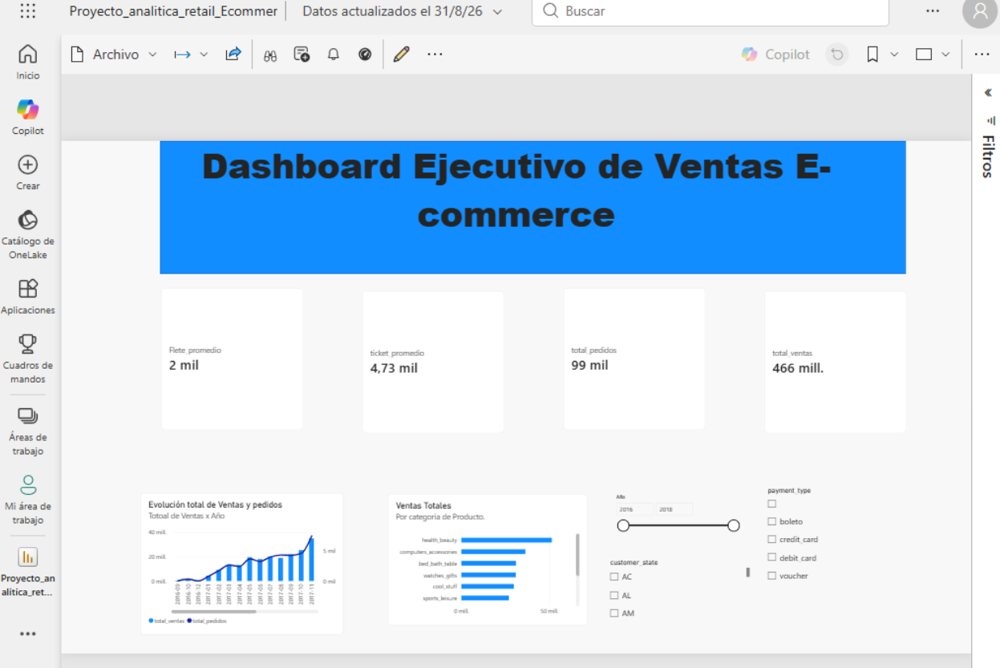

# 📊 E-Commerce Sales & Logistics Executive Analytics

Un tablero interactivo en Power BI diseñado para analizar el rendimiento comercial, el volumen de pedidos y el comportamiento logístico de una plataforma de e-commerce. Este proyecto implementa un modelo de datos en estrella (*Star Schema*), medidas personalizadas en DAX y visualizaciones dinámicas.

---

## 📸 Vista Previa del Dashboard

*(Agrega aquí una captura de pantalla de tu tablero terminado)*


---

## 🎯 Objetivo del Proyecto

El objetivo principal es transformar datos transaccionales crudos en insights accionables para la toma de decisiones ejecutivas. El tablero responde a preguntas clave de negocio como:
* ¿Cuál es la tendencia mensual de ingresos y volumen de pedidos?
* ¿Cuáles son las categorías de productos más vendidas?
* ¿Cómo varían el ticket promedio y el costo de flete según la región o el método de pago?

---

## 🛠️ Arquitectura y Modelado de Datos

El proyecto sigue un **Esquema en Estrella (Star Schema)** enfocado en la tabla de hechos de ventas:

* **Tabla de Hechos:**
  * `Fact_Ventas`: Registro detallado de transacciones (precios, fletes, IDs de orden, cliente, producto y vendedor).
* **Tablas de Dimensión:**
  * `dim_Calendario`: Tabla de fechas para análisis temporal.
  * `Dim_Clientes`: Información demográfica y ubicación geográfica (`customer_state`).
  * `Dim_Productos`: Categorías e información de productos.
  * `Dim_Vendedores`: Datos analíticos del equipo de ventas.

---

## 🧮 Métricas Clave (Medidas DAX)

Las métricas del negocio fueron consolidadas en una tabla dedicada (`_Medidas`):

* **Total Ventas:**
  ```dax
  Total_Ventas = SUM(Fact_Ventas[price])
  Total_Pedidos = DISTINCTCOUNT(Fact_Ventas[order_id])
  Ticket_Promedio = DIVIDE([Total_Ventas], [Total_Pedidos], 0)
  Flete_Promedio = AVERAGE(Fact_Ventas[freight_value])